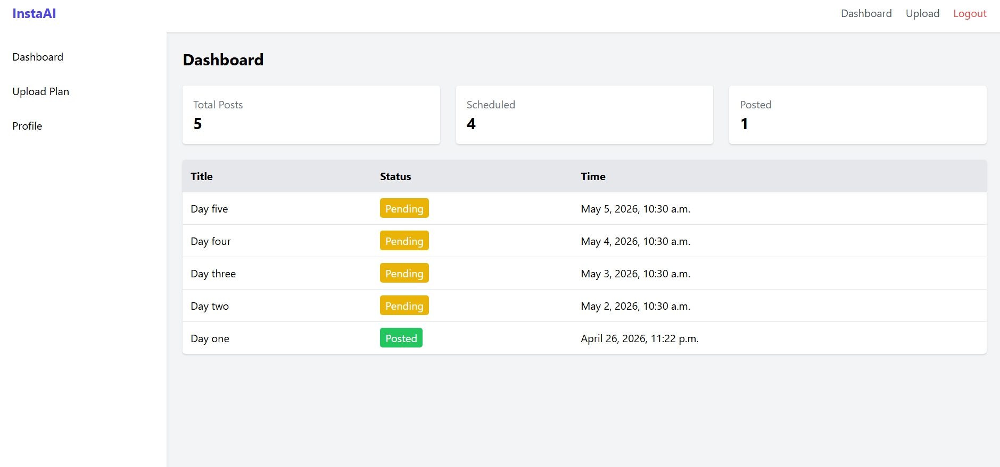
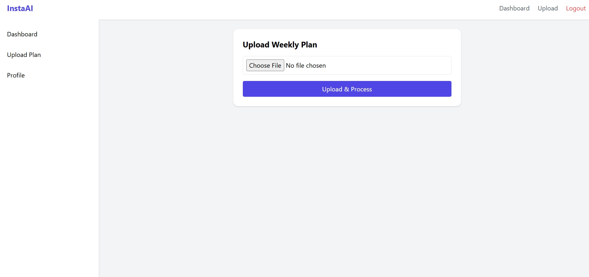
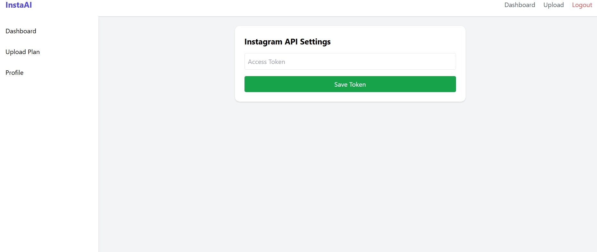

# Post_Automation
Social Media Automation System

# Insta AI Automation

A production-ready Django web application that automates AI-generated Instagram posts based on a weekly Excel plan.
It generates images using AI, schedules posts, publishes via Instagram Graph API, and tracks performance analytics.

---

## Features

*  Upload weekly content plan via Excel (.xlsx)
*  AI-generated images using OpenAI
*  Automated scheduling with Celery + Redis
*  Instagram auto-posting via Graph API
*  Analytics dashboard (likes, impressions, timestamps)
*  Secure token storage (encrypted)

---

## Tech Stack

* **Backend:** Django, Django REST Framework
* **Frontend:** Tailwind CSS
* **Database:** MySQL
* **Task Queue:** Celery + Redis
* **AI Integration:** OpenAI (DALL·E / Image API)
* **APIs:** Instagram Graph API

---

##  Project Structure

```
post_automation/
│
├── post_automation/                  # Project settings & Celery config
│   ├── __init__.py
│   ├── settings.py
│   ├── celery.py
│   ├── urls.py
│
├── apps/
│   ├── accounts/            # Authentication & user profiles
│   ├── planner/             # Excel upload & content planning
│   ├── generator/           # AI image generation logic
│   ├── scheduler/           # Celery background tasks
│   ├── analytics/           # Performance tracking
│
├── templates/               # HTML templates
├── static/                  # Static files (CSS, JS)
├── media/                   # Uploaded & generated images
├── theme/                   # Tailwind CSS app
│
├── manage.py
├── .env
```

---

## Setup Instructions

### 1️ Clone the repository

```bash
git clone <your-repo-url>
cd insta_automation
```

### 2️ Create virtual environment

```bash
python -m venv venv
source venv/bin/activate   # Windows: venv\Scripts\activate
```

### 4️ Setup environment variables

Create a `.env` file in the root directory (see below)

### 5️ Apply migrations

```bash
python manage.py migrate
```

### 6️ Run development server

```bash
python manage.py runserver
```

### 7️ Start Tailwind (UI)

```bash
python manage.py tailwind start
```

### 8️ Start Redis

```bash
redis-server
```
or
Install/open Docker Desktop

```bash
docker run --name post-redis -p 6379:6379 -d redis
Test-NetConnection 127.0.0.1 -Port 6379
```


### 9️ Start Celery worker

```bash
celery -A config worker -l info
```

---

## Environment Variables (.env)

```env
# Django
SECRET_KEY=your_secret_key
DEBUG=True

# Database (MySQL)
DB_NAME=insta_db
DB_USER=root
DB_PASSWORD=your_password
DB_HOST=localhost

# OpenAI
OPENAI_API_KEY=your_openai_api_key

# Instagram API
INSTAGRAM_APP_ID=your_app_id
INSTAGRAM_APP_SECRET=your_app_secret
INSTAGRAM_ACCESS_TOKEN=your_access_token

# Redis / Celery
REDIS_URL=redis://127.0.0.1:6379/0

# Encryption
ENCRYPTION_KEY=your_fernet_key
```

---

## AI Tools Used

* **OpenAI Image Generation (DALL·E / Images API)**
  Used to generate Instagram-ready posters based on content prompts.

* **Prompt Engineering**
  Combines Title + Content from Excel to create visually relevant images.

---

## Workflow

1. Upload Excel plan
2. Parse data → store in database
3. Generate AI images
4. Schedule posts (Celery)
5. Publish via Instagram Graph API
6. Fetch analytics → display in dashboard

---

## Security Practices

* API tokens encrypted before storage
* Secrets stored in `.env`
* CSRF protection enabled
* Secure file upload validation

---

## UI Preview

### Dashboard



---
### Upload Page



---
### Profile Page


---

##  Author

**Muhammed Mishab CH**

---
